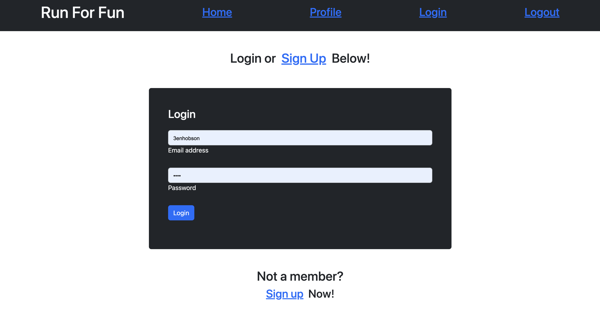
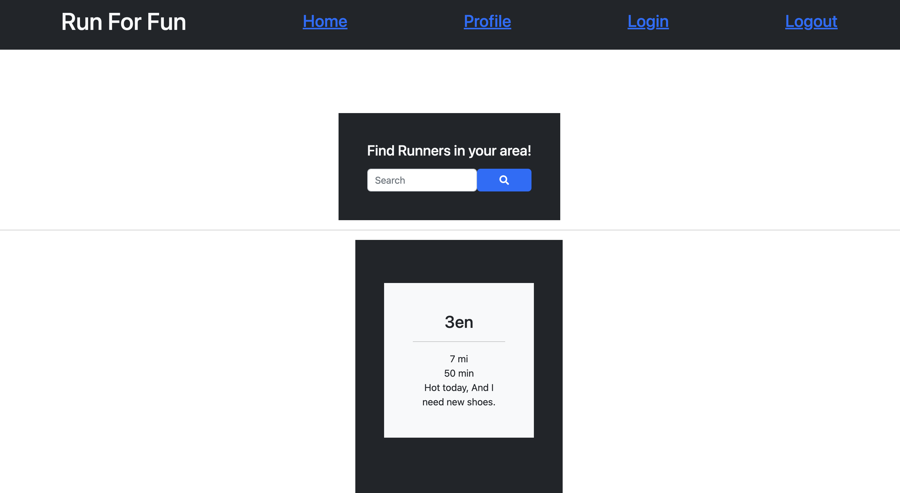

# run-for-fun

## Description

Run For Fun is a social platform that aims to connect people in the running community with other runners. Using MVC (Model-View-Controller) framework, this project allows users to create posts using measurements of distance, time, and a unique description of their most recent run, which are then appended to the "Home" page. The data from the post is also dynamically populated on the users profile page with the help of chart.js. 

## Installation

The webapp is deployed on Heroku and can be accessed via the following link.

https://run-4-fun.herokuapp.com/

## Usage

The first page displayed to the user is the homepage where runs from all users are displayed as posts. To access a personal profile, the user must click "Login" on the top of the screen. From there, the user will be prompted to either sign into their account or sign up for a new account. Once the form is filled out, the user will be redirected to their personal profile. To log in a run, fill out the form on the profile page. Once that is filled in, and the user hits submit, the graph will change to reflect the run and and a new post will be appended to the "Home" page. 

md
md
md

## Credits
This project was created in collaboration with Alejandra Quintero. 
TA Meg Meyers and Professor Diarmuid Murphy helped troubleshooting the code.
